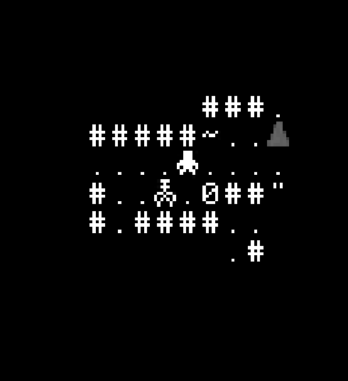
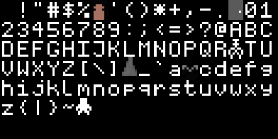

# The Hollow of Marrowfall
_A work-in-progress dungeon crawler ASCII roguelike_

---

---

## About
The Hollow of Marrowfall is a turn-based ASCII roguelike where every move could be your last. Descend into a sprawling mine once carved for oil, but perhaps dug too deep. Scavenge, fight, and adapt as you delve deeper into the Hollow, facing creatures that feed off light, or lurk in the shadows. Death is permanent, progress is earned, and only those who learn the rhythm of the dark will survive long enough to claim their 10,000 liters of oil.

---

## Current Status
- playable up to the 3rd biome in the terminal
	- many more rooms need made for the all biomes
- working on moving to sdl so real graphics can be used, so a sdl window will open when you start the game, just ignore it
- the game really needs balancing, I haven't played much past the first biome
- Implemented: traps, status effects, armor, weapons, spells, enemies
- Not Implelmented: fishing, mining, foraging, player weapon knockback, enemies confusing the player, self healing (currently the healing spell works as a damaging spell), view mode, log book, character sheet, NPCs

> Note: This game is in early development. These are just the main bullet points there are many things being worked on. Features and mechanics are subject to change.

---

## How to Run
### compile
- Compile the game with :
- `cmake`
- `cd build/`
- `make`
- `./ck`
### controls
- Controls:
  - WASD movement
  - space: pass turn
  - e: attack, arrow keys will just attack in a direction without the need to press e
  - f: power up lantern
  - i: Inventory
  - enter: in inventory will either loot/use/equip an item
  - b: drops item on ground

---

## License
ncurses is licensed under a permissive license (MIT-like). See [ncurses.txt](licenses/ncurses.txt)
